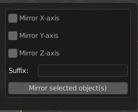
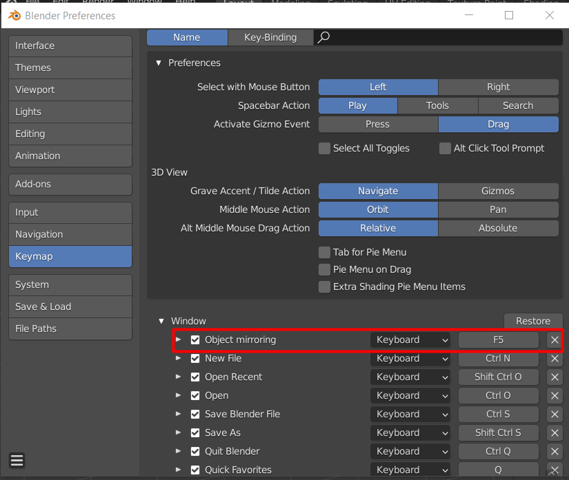

# Introduction
A Blender add-on with enhanced control over model mirroring.

It is supported by Blender versions **2.8X.X - 2.9X.X** (fully tested on these, most probably will work on newer as well) 

# Installation
To install this add-on, download the intended released version ([TBA](https://github.com/HarryHeres/Blender-mirroring-tool)) and proceed as follows: [How to install](https://docs.blender.org/manual/en/latest/editors/preferences/addons.html).
After a successfull installation, the add-on should be active under the **F5** hotkey.

# Add-on's quick overview
The add-on's GUI is fairly simple:

 
 

 

### Mirror axis
- Select which axis do you want to mirror the selected object(s) through (can choose multiple at once).

### Suffix
- Suffix for the newly mirrored models. Can be left empty.

### Mirror global axis + origin
- The object's origin point is moved to the global axis, the rotation is cleared and the scale values are set to **1**

### Hotkey remapping
- In default, the hotkey is **F5**. This can be easily changed in **Edit -> Preferences -> Keymap -> Window -> Object mirroring**

 
 

 

# Usage
- Select object(s) (can select multiple) that you desire to mirror
- Press F5 (**default**) to show the appropriate menu
- Select which axis you want to mirror through
- *Optional*: Set a suffix for newly mirrored models
- Press "Mirror object(s)" button and watch the magic happen! 

# Troubleshooting
- If you run into any problems, please feel free to open an issue, describing your problem!

# Contributors
**Hearthwarming thanks to everyone that has contributed to this project!**
- @HarryHeres - Main developer
- @evaherbst - Initial add-on idea, contributor 